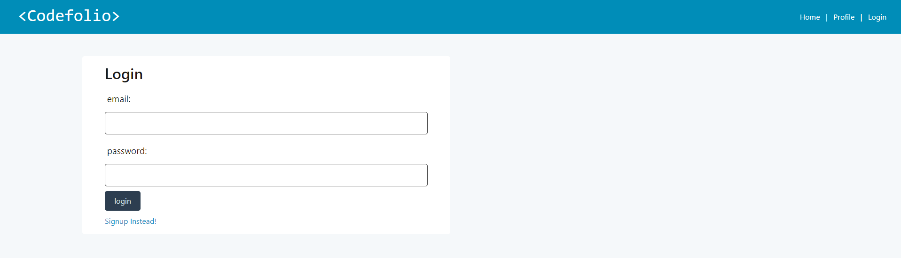
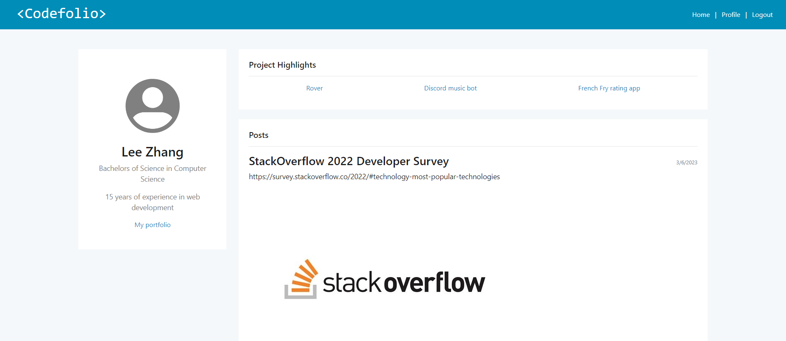
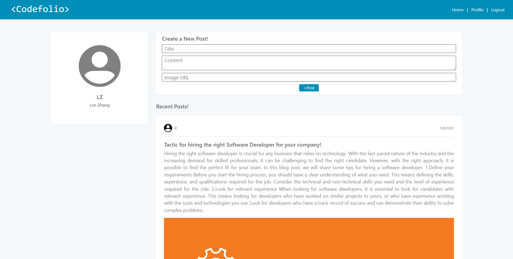

# Codefolio

Codefolio is a professional networking website designed for tech enthusiasts, developers, and programmers to showcase their projects, skills, and experiences.

## Features

* Display your experience, education, and past projects
* Post and view blogs across all users
* Post and view comments
* React to images
* Receive a custom email on sign-up

## Technologies Used

* HTML5
* CSS3 (BootStrap CSS framework)
* Nodemailer
* Bcrypt
* Connect-Session
* Sequeliz
* Dotenv
* Express
* Handlebars
* Mysql12

## Mock-Up

## Deployed Application
https://frozen-brushlands-64969.herokuapp.com/login

## How to Use
Visit the website at https://frozen-brushlands-64969.herokuapp.com/login, please create an account or log in.

